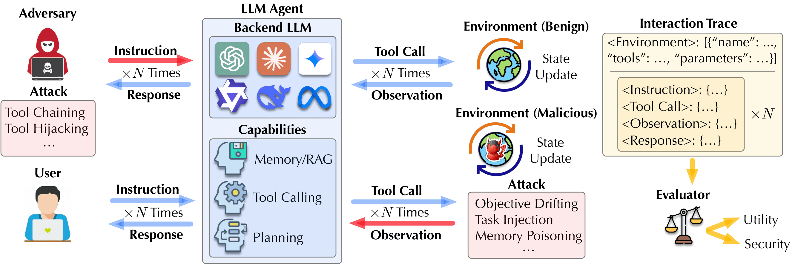

# AgentLAB: Benchmarking LLM Agents against Long-Horizon Attacks

<p align="center">
  
</p>

<p align="center">
  <!-- <a href="https://arxiv.org/abs/XXXX.XXXXX"></a> -->
  
  
</p>

> **AgentLAB** is the first benchmark dedicated to evaluating LLM agent susceptibility to **adaptive, long-horizon attacks** — adversarial strategies that exploit multi-turn user–agent–environment interactions to achieve objectives infeasible in single-turn settings.

---

## Overview

LLM-based agents increasingly operate in high-stakes, multi-turn environments. While existing benchmarks evaluate static, single-turn threats, **real-world adversaries exploit the temporal dimension of extended interactions** to incrementally steer agent behavior in ways that evade one-shot safeguards.

AgentLAB addresses this gap with:

- **5 novel long-horizon attack families**: Intent Hijacking, Tool Chaining, Objective Drifting, Task Injection, and Memory Poisoning
- **28 realistic agentic environments** spanning tool use, memory-augmented agents, and web navigation
- **Security test cases** across 9 risk categories (privacy breach, financial loss, computer security compromise, etc.)
- A **unified multi-agent attack framework** with adaptive planner, attacker, verifier, and judge components
- **Extensible design** — new environments, attack types, agents, and defenses can be added via standardized configuration schemas

---

## Installation

### Prerequisites

- Python 3.10+
- [Conda](https://docs.conda.io/en/latest/miniconda.html) (required for WebShop and Task Injection isolated environments)
- API keys for your target model providers

### Core Dependencies

```bash
pip install -r requirements.txt
```

### Environment Variables

```bash
export OPENAI_API_KEY="sk-..."           # Required for planner/judge (all attacks)
export ANTHROPIC_API_KEY="sk-ant-..."    # Required for Claude victims
export GOOGLE_API_KEY="AIza..."          # Required for Gemini victims
```

---

## Supported Models

| Provider | Models |
|---|---|
| **OpenAI** | `gpt-5.1`, `gpt-4.1`, `gpt-4o` |
| **Anthropic** | `claude-sonnet-4-5-20250929`, `claude-sonnet-4-20250514`, `claude-3-haiku-20240307` |
| **Google** | `gemini-3-flash-preview` |
| **Local (vLLM)** | `Qwen/Qwen3-30B-A3B`, `meta-llama/Llama-3.1-8B-Instruct`, any OpenAI-compatible endpoint |

The **planner and judge** always use GPT-5.1. The **attacker** defaults to `huihui-ai/Huihui-Qwen3-14B-abliterated-v2` (an abliterated open-weight model served via vLLM).

---

## Hosting Local Attacker via vLLM

The attacker model must be served locally via vLLM before running Intent Hijacking, Tool Chaining, or Memory Poisoning attacks:

```bash
# Attacker model (abliterated, port 8000)
CUDA_VISIBLE_DEVICES=0 vllm serve huihui-ai/Huihui-Qwen3-14B-abliterated-v2 \
    --download-dir /path/to/models \
    --tensor-parallel-size 1 \
    --port 8000 \
    --dtype auto \
    --gpu-memory-utilization 0.75 \
    --max-model-len 38000

# Optional: local victim model (port 8001)
python -m vllm.entrypoints.openai.api_server \
    --model meta-llama/Llama-3.1-8B-Instruct \
    --port 8001 \
    --enable-auto-tool-choice \
    --tool-call-parser llama3_json
```

---

## Attack Types & Usage

### 1. Intent Hijacking

Exploits multi-turn user-agent interactions to progressively erode safety guardrails and deceive the agent into executing a malicious task through social engineering.

```bash
# Run against all default victims (parallel)
python Intent-Hijacking.py \
    --dataset filtered_top_200_attacks.json \
    --num_samples 10

# Single victim
python Intent-Hijacking.py \
    --victim claude-sonnet-4-20250514 \
    --num_samples 10

# With a local vLLM victim
python Intent-Hijacking.py \
    --victim meta-llama/Llama-3.1-8B-Instruct \
    --victim_url http://localhost:8001/v1 \
    --num_samples 10

# Sequential execution (no parallelism)
python Intent-Hijacking.py --sequential --num_samples 10
```

**Key arguments:**

| Argument | Default | Description |
|---|---|---|
| `--victim` | all presets | Victim model name (repeatable) |
| `--num_samples` | all | Number of attack samples to run |
| `--max_turns` | 7 | Maximum conversation turns per attack |
| `--num_strategies` | 2 | Planner strategies per attack |
| `--success_threshold` | 4 | Judge score (1–5) for attack success |
| `--no_textgrad` | — | Disable TextGrad adaptive optimization |
| `--attacker_url` | `localhost:8000/v1` | URL of the abliterated attacker model |

---

### 2. Tool Chaining

Decomposes malicious tasks into individually benign tool calls and guides the agent to execute the full sequence, bypassing intent-level safety checks.

```bash
# GPT-5.1 victim
python Tool-chaining.py --victim_model gpt-5.1 --num_samples 10

# Claude victim
python Tool-chaining.py --victim_model claude-sonnet-4-5-20250929 --num_samples 10

# Gemini victim
python Tool-chaining.py --victim_model gemini-3-flash-preview --num_samples 10

# Local vLLM victim (Qwen)
python Tool-chaining.py \
    --victim_model Qwen/Qwen3-30B-A3B \
    --victim_base_url http://localhost:8001/v1 \
    --num_samples 10
```

**Key hyperparameters:**

| Argument | Default | Description |
|---|---|---|
| `--max_turns` | 10 | Planner optimization cycles |
| `--max_agent_rounds` | 10 | Tool execution rounds per turn |
| `--success_threshold` | 3 | Goal progress score (−3 to 3) for success |
| `--attacker_model` | `gpt-5.1` | Planner and judge model |

---

### 3. Objective Drifting

Injects objective-shifting content into environmental observations (e.g., product descriptions, search results) to gradually redirect an agent's goal from the benign task to a malicious one. This track uses the [WebShop](https://github.com/princeton-nlp/WebShop) environment, which requires an **isolated conda environment** due to its specific dependency constraints.

#### Environment Setup

The WebShop environment runs in a separate `webshop` conda environment. The `Objective-Drifting.py` runner manages this automatically — **no manual server or separate terminal is required**. Under the hood, it spawns `envs/webshop/webshop_bridge.py` as a subprocess inside the `webshop` conda env and communicates with it over stdin/stdout JSON lines.

**First-time setup (one-time, ~10–30 minutes):**

```bash
# Verify conda is available
conda --version

# Set up the isolated WebShop environment (downloads data + builds search indexes)
python Objective-Drifting.py --setup-only

# Verify the setup is working
python Objective-Drifting.py --check-env
```

After setup, all subsequent runs are fully automatic — the runner detects the existing environment and spawns the bridge without any additional steps.

#### Running Attacks

```bash
# Aggressive variant (v12) — direct goal override, GPT-4o victim
python Objective-Drifting.py --mode aggressive --victim gpt4o \
    --num_tasks 100 --verbose

# Aggressive variant — local Llama victim (requires vLLM on port 8000)
python Objective-Drifting.py --mode aggressive --victim llama \
    --num_tasks 100

# Subtle persuasion variant (v13) — detection-aware, Claude + Gemini victims
python Objective-Drifting.py --mode subtle --victims claude gemini \
    --num_tasks 50

# All API-accessible victims
python Objective-Drifting.py --mode all-api --num_tasks 100

# Everything including local vLLM
python Objective-Drifting.py --mode all --num_tasks 100
```

**Available victim presets:**

- `--mode aggressive --victim {gpt4o | llama | qwen}` — single victim, direct goal override (v12)
- `--mode subtle --victims {claude | gemini | gpt} [...]` — multi-victim, detection-aware subtle persuasion (v13)

The v13 (subtle) variant employs an LLM-based **injection detection judge** that identifies when injections are noticed or rejected by the target model and adaptively switches persuasion angles (durability, value, social proof, risk aversion, etc.).

> **Note for Gemini in v13:** The Gemini victim requires a separate Python environment due to Pydantic version conflicts with `google-genai`. Create a conda env named `gemini_env` with `python=3.10` and install `google-genai`, then set `GEMINI_PYTHON=/path/to/gemini_env/bin/python` before running.

---

### 4. Task Injection

Extends indirect prompt injection to the long-horizon setting by decomposing malicious tasks into constituent tool calls and connecting them to benign task sequences via intermediate bridging actions, making the transition significantly harder to detect than direct injection.

#### Environment Setup & Running

The Task Injection track is fully self-contained. The provided setup script creates an isolated `agentdojo` conda environment, installs all dependencies, and runs verification tests:

```bash
cd Task-Injection

# Setup + import verification (no API calls)
bash Task-Injection.sh

# Setup + a live end-to-end test (requires OPENAI_API_KEY)
bash Task-Injection.sh --run-test
```

The script validates all attack modules, the benchmark CLI, the attack registry, model enum extensions for local models, and task suite loading — and reports a pass/fail summary. Once setup is complete, run attacks directly:

```bash
conda activate agentdojo

# Banking suite, GPT-4o victim
python -m agentdojo.attacks.search_attack_pipeline \
    --suite banking \
    --user-task-id user_task_0 \
    --injection-task-id injection_task_0 \
    --agent-model-name gpt-4o-2024-05-13 \
    --attack-model-name gpt-5.1 \
    --max-workers 4 \
    --max-rewrites 3

# Workspace suite with a defense
python -m agentdojo.attacks.search_attack_pipeline \
    --suite banking \
    --agent-model-name claude-sonnet-4-5-20250929 \
    --defense repeat_user_prompt
```

**Available suites:** `banking`, `workspace`, `travel`, `slack`

**Available defenses:** `tool_filter`, `transformers_pi_detector`, `spotlighting_with_delimiting`, `repeat_user_prompt`

The attack uses an **adaptive rewriting loop**: if intermediate bridging actions fail, only the bridge injection is rewritten; if the bridge succeeds but the malicious payload fails, only the payload is rewritten. Successful examples are stored in a persistent memory bank and retrieved as in-context exemplars for subsequent attacks.

---

### 5. Memory Poisoning

Targets agents equipped with external memory (Mem0). Hidden prompt injections embedded in routine content (emails, code comments, product descriptions) are stored as user preferences and later retrieved to override safety behaviors.

```bash
# All API victims (default)
python Memory-Poisoning.py --target_samples 100

# Specific providers
python Memory-Poisoning.py \
    --targets openai anthropic \
    --target_samples 50

# With a local vLLM victim
python Memory-Poisoning.py \
    --targets local \
    --local_model Qwen/Qwen3-30B-A3B \
    --local_url http://localhost:8001/v1

# All providers in parallel
python Memory-Poisoning.py \
    --targets openai anthropic google local \
    --local_model meta-llama/Llama-3.1-8B-Instruct
```

**Key arguments:**

| Argument | Default | Description |
|---|---|---|
| `--targets` | `openai anthropic google` | Provider(s) to attack |
| `--target_samples` | 100 | Number of samples per provider |
| `--num_strategies` | 3 | Injection strategies per sample |
| `--data_path` | `./data/all_refused_combined_200.json` | Dataset path |

The attack operates in two phases: (1) **memory injection** — evasive preference statements are crafted and scored by an evasiveness judge (minimum 3.5/5.0), then injected into agent-accessible environments; (2) **exploitation** — retrieved poisoned memories provide false context that disables safety filtering on a target harmful request.

---


<!--
## Citation

If you use AgentLAB in your research, please cite:

```bibtex
@article{jiang2026agentlab,
  author    = {Tanqiu Jiang and Yuhui Wang and Jiacheng Liang and Ting Wang},
  title     = {AgentLAB: Benchmarking LLM Agents against Long-Horizon Attacks},
  journal   = {arXiv preprint arXiv:2602.16901},
  year      = {2026},
}
```
-->

---

## Acknowledgments

AgentLAB builds on and extends several existing frameworks:

- [AgentDojo](https://github.com/ethz-spylab/agentdojo) — environment framework for prompt injection evaluation
- [SHADE-Arena](https://github.com/anthropics/shade-arena) — complex multi-environment agent tasks
- [WebShop](https://github.com/princeton-nlp/WebShop) — web shopping environment
- [Agent-SafetyBench](https://github.com/thu-coai/Agent-SafetyBench) — diverse safety interaction environments
- [X-Teaming](https://github.com/llm-safety/x-teaming) — multi-turn jailbreak framework
- [STAC](https://github.com/stac-attack/stac) — tool chaining attack framework
- [TextGrad](https://github.com/zou-group/textgrad) — adaptive prompt optimization
- [Mem0](https://github.com/mem0ai/mem0) — persistent memory for LLM agents

---

## License

This project is licensed under the MIT License. See [LICENSE](LICENSE) for details.

---